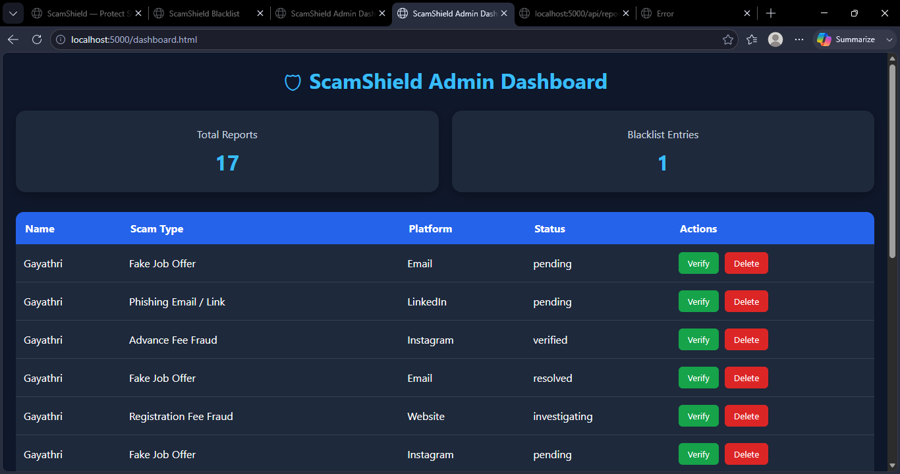

# 🛡 ScamShield

ScamShield is a Full Stack Cyber Scam Reporting Platform designed to help students and job seekers identify and report fake job offers, internship scams, phishing attacks, and recruitment fraud.

## Features

* Scam Reporting System
* Screenshot Evidence Upload
* Email Notifications
* Admin Dashboard
* Report Verification System
* Public Scam Blacklist
* Scam Detection Quiz
* Mobile Responsive Design
* MongoDB Database Storage

## Tech Stack

### Frontend

* HTML
* CSS
* JavaScript

### Backend

* Node.js
* Express.js

### Database

* MongoDB Atlas

### Additional Tools

* JWT Authentication
* Nodemailer
* Multer
* Render

## Project Workflow

1. User submits scam report.
2. Report is stored in MongoDB.
3. Confirmation email is sent.
4. Admin reviews report.
5. Verified reports are added to public blacklist.
6. Users can search blacklist and learn scam awareness through quiz.

## Installation

```bash
npm install
npm start
```

## Screenshots

### Homepage


### Admin Dashboard


### API Blacklist


### Blacklist Page


### Dashboard Page


### Mobile View


### Quiz Page


### Report Page


### Verified Reports


## Live Demo

Coming Soon

## Author

Gayathri N
```

