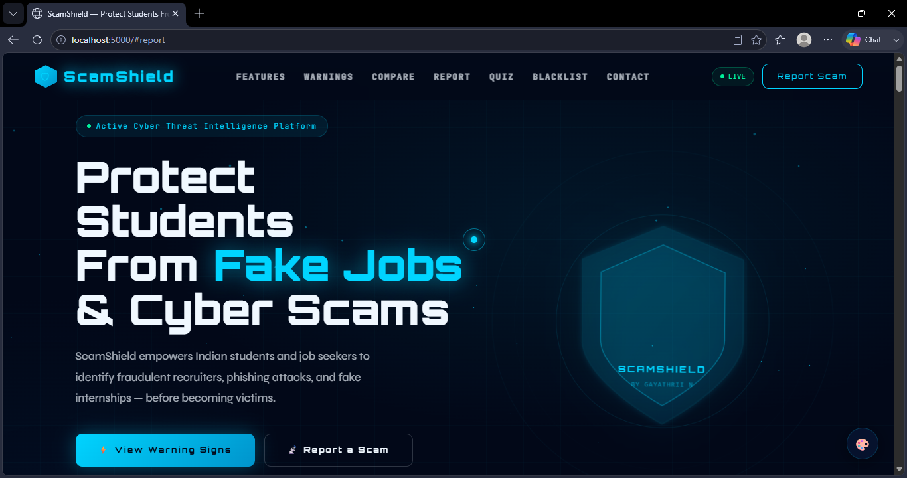
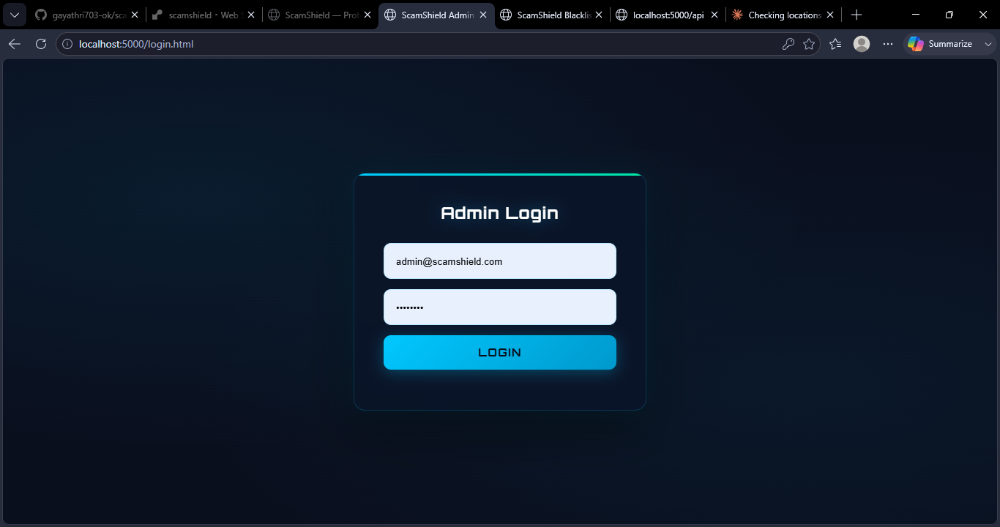
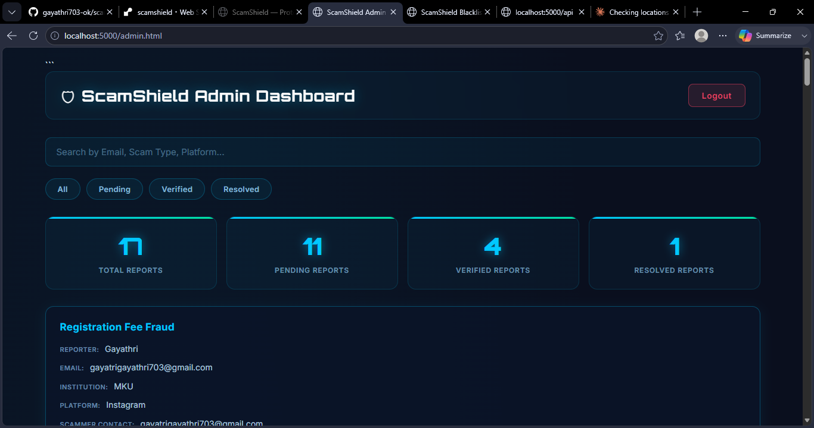
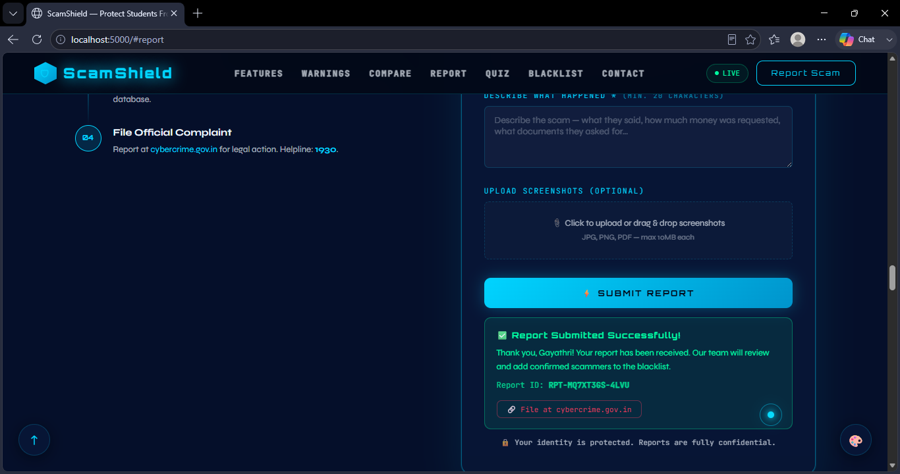
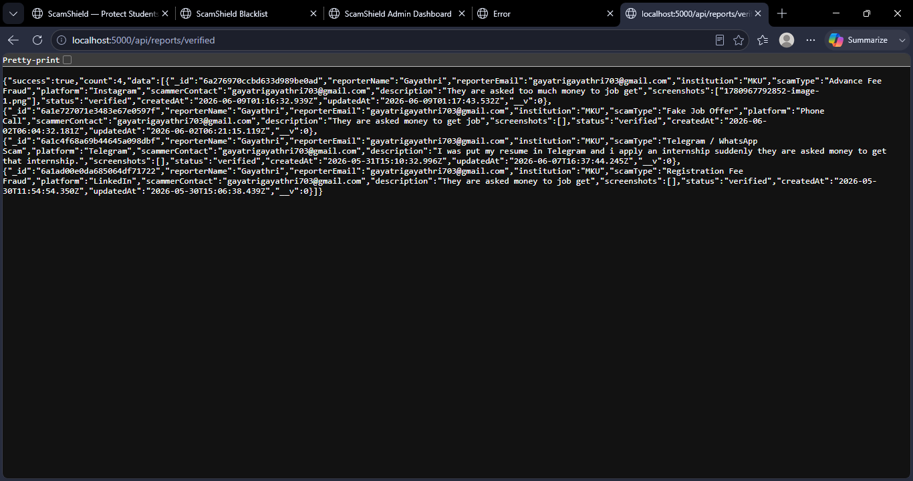
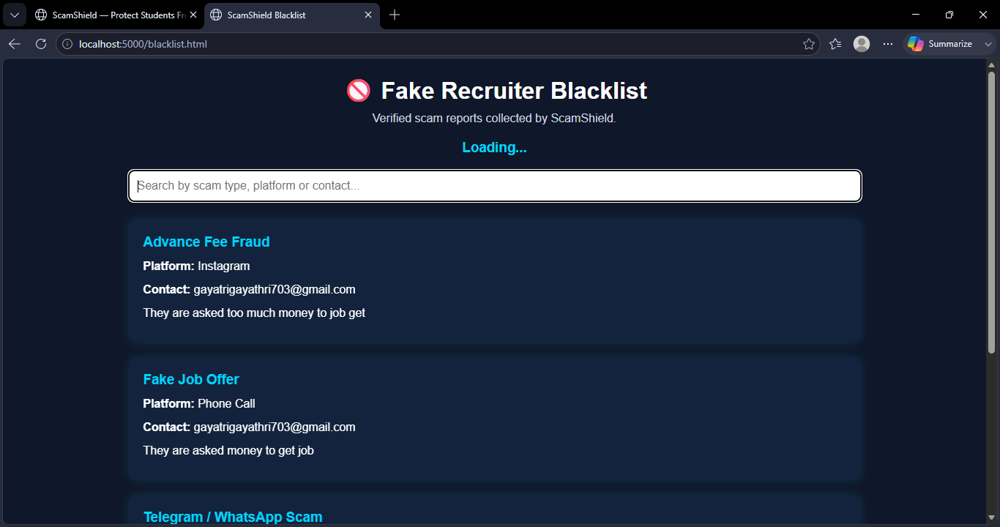
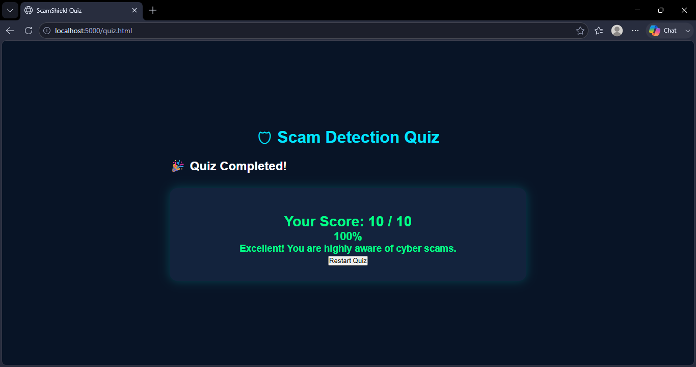
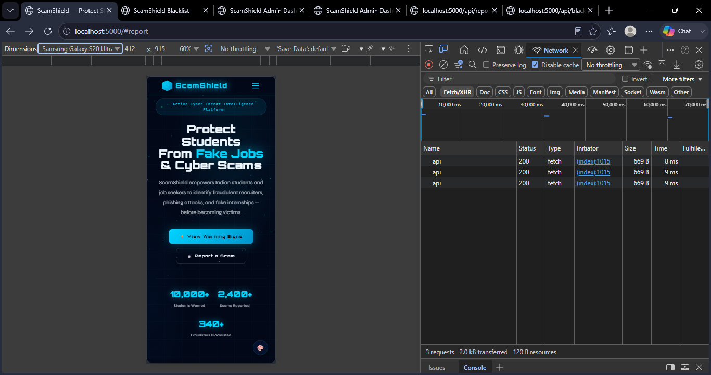
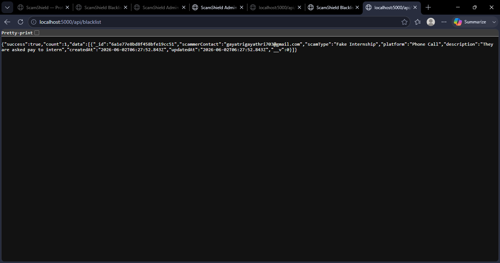

# 🛡️ ScamShield

<div align="center">



### **Protecting Students & Job Seekers from Online Fraud**

*A full-stack cyber scam reporting, verification, and awareness platform*

[](https://scamshield-7cve.onrender.com)
[](https://github.com/gayathri703-ok)
[](https://nodejs.org)
[](https://www.mongodb.com/atlas)
[](https://render.com)

</div>

---

## 📌 Table of Contents

- [Overview](#-overview)
- [Live Demo](#-live-demo)
- [Screenshots](#-screenshots)
- [Features](#-features)
- [Tech Stack](#-tech-stack)
- [Project Workflow](#-project-workflow)
- [Modules](#-project-modules)
- [Installation](#-installation)
- [Environment Variables](#-environment-variables)
- [Skills Demonstrated](#-skills-demonstrated)
- [Future Enhancements](#-future-enhancements)
- [Author](#-author)

---

## 📖 Overview

Online recruitment scams, fake internships, phishing attacks, and fraudulent job offers are becoming increasingly common among students and fresh graduates. **ScamShield** was built to fight back.

It provides a centralized platform where users can:

- 🔴 Report suspicious scams with evidence
- 📧 Receive email confirmation of their report
- 🔍 Search a public scam blacklist
- 🧠 Learn to spot scams through an interactive quiz
- 🛡️ Help administrators verify and act on reports

> *Built as a real-world full-stack project to solve a genuine problem faced by students across India.*

---

## 🚀 Live Demo

| Resource | Link |
|---|---|
| 🌐 Live Application | [scamshield-7cve.onrender.com](https://scamshield-7cve.onrender.com) |
| 💻 GitHub Repository | [github.com/gayathri703-ok](https://github.com/gayathri703-ok) |

---

## 📸 Screenshots

<details>
<summary><b>🏠 Homepage</b></summary>


</details>

<details>
<summary><b>🔐 Admin Login</b></summary>



</details>

<details>
<summary><b>📊 Admin Dashboard</b></summary>



</details>

<details>
<summary><b>📋 Report Page</b></summary>



</details>

<details>
<summary><b>✅ Verified Reports</b></summary>



</details>

<details>
<summary><b>🚫 Blacklist Page</b></summary>



</details>

<details>
<summary><b>🧠 Quiz Page</b></summary>



</details>

<details>
<summary><b>📱 Mobile View</b></summary>



</details>

<details>
<summary><b>🔌 API Blacklist</b></summary>



</details>

---

## ✨ Features

### 📋 Scam Reporting System
- Submit detailed scam reports with category selection
- Provide recruiter/contact information
- Upload screenshots and PDF evidence
- Receive instant email confirmation

### 🔐 Secure Admin Authentication
- JWT-based login system
- Protected dashboard routes
- Secure session management

### 📊 Admin Dashboard
- View, search, and filter all reports
- Update report status (Pending → Investigating → Verified → Resolved)
- Delete invalid reports
- Real-time analytics cards

### ✅ Scam Verification Workflow

```
Submitted → Pending → Investigating → Verified → Published to Blacklist
                                   ↘ Resolved (closed without publishing)
```

### 🚫 Public Scam Blacklist
- Search by scammer name, contact, or platform
- View verified scam cases publicly
- Helps users cross-check before trusting recruiters

### 🧠 Scam Awareness Quiz
- Interactive questions on phishing, fake internships, and social engineering
- Educates users on cybersecurity best practices

### 📱 Fully Responsive
- Optimized for Desktop, Tablet, and Mobile

---

## 🛠 Tech Stack

### Frontend


### Backend


### Database


### Security & Auth


### File & Email


### Deployment


---

## 📂 Project Workflow

```
User Submits Report
        │
        ▼
Evidence Uploaded (Multer)
        │
        ▼
Report Saved to MongoDB Atlas
        │
        ▼
Confirmation Email Sent (Nodemailer)
        │
        ▼
Admin Reviews via Dashboard (JWT Protected)
        │
        ├──► Investigating
        │
        ├──► Verified ──► Added to Public Blacklist
        │
        └──► Resolved / Deleted
```

---

## 📊 Project Modules

| Module | Description | Status |
|---|---|---|
| 🏠 Landing Page | Hero, features, warnings, compare sections | ✅ Complete |
| 📋 Scam Report Form | Multi-field form with file upload | ✅ Complete |
| 📸 Evidence Upload | Image & PDF support via Multer | ✅ Complete |
| 🗄️ MongoDB Integration | Atlas cloud database with Mongoose | ✅ Complete |
| 📧 Email Notifications | Reporter + admin alerts via Nodemailer | ✅ Complete |
| 🔐 Admin Auth | JWT login with protected routes | ✅ Complete |
| 📊 Admin Dashboard | Search, filter, verify, resolve, delete | ✅ Complete |
| ✅ Verification Workflow | Pending → Investigating → Verified → Resolved | ✅ Complete |
| 🚫 Public Blacklist | Searchable verified scam database | ✅ Complete |
| 🧠 Awareness Quiz | Interactive scam education quiz | ✅ Complete |
| 📱 Responsive Design | Mobile, tablet, desktop optimized | ✅ Complete |
| 🚀 Deployment | Live on Render via GitHub | ✅ Complete |

---

## ⚙️ Installation

```bash
# 1. Clone the repository
git clone https://github.com/gayathri703-ok/scamshield.git

# 2. Navigate to the project folder
cd scamshield

# 3. Install dependencies
npm install

# 4. Create your .env file (see below)

# 5. Start the server
npm start
```

Server runs at `http://localhost:5000`

---

## 🔐 Environment Variables

Create a `.env` file in the root directory:

```env
MONGO_URI=your_mongodb_atlas_connection_string
PORT=5000
JWT_SECRET=your_jwt_secret_key
EMAIL_USER=your_gmail_address
EMAIL_PASS=your_gmail_app_password
```

> ⚠️ Never commit your real `.env` file to GitHub. Add it to `.gitignore`.

---

## 🎯 Skills Demonstrated

<details>
<summary><b>Frontend Development</b></summary>

- Responsive Web Design (CSS Grid, Flexbox)
- Mobile Navigation & Hamburger Menus
- DOM Manipulation & Dynamic Rendering
- Form Validation & User Feedback
- Fetch API Integration with async/await

</details>

<details>
<summary><b>Backend Development</b></summary>

- REST API Design (GET, POST, PATCH, DELETE)
- Express.js Routing & Middleware
- Server-Side Validation & Error Handling
- File Upload Handling with Multer
- JWT Authentication & Protected Routes

</details>

<details>
<summary><b>Database Management</b></summary>

- MongoDB Atlas Cloud Setup
- Mongoose Schema Design & Data Modeling
- CRUD Operations
- Query Filtering & Sorting

</details>

<details>
<summary><b>Security</b></summary>

- JWT Token Authentication
- bcryptjs Password Hashing
- Helmet.js Security Headers
- Express Rate Limiting
- Environment Variable Management

</details>

<details>
<summary><b>DevOps & Deployment</b></summary>

- Git Version Control Workflow
- GitHub Repository Management
- Render Cloud Deployment
- Production Environment Configuration

</details>

---

## 🔮 Future Enhancements

- [ ] 🤖 AI-Powered Scam Detection (NLP-based auto-classification)
- [ ] 📊 Scam Trend Analytics Dashboard
- [ ] 👤 User Accounts & Report History
- [ ] 🔔 Real-Time Notifications
- [ ] 📤 Report Export (CSV / PDF)
- [ ] 🌐 Multi-Language Support
- [ ] 🌙 Dark / Light Mode Toggle
- [ ] 📩 Email Verification on Registration

---

## 👩‍💻 Author

<div align="center">

**Gayathri N**

[](https://github.com/gayathri703-ok)
[](mailto:gayatrigayathri703@gmail.com)

</div>

---

## 📄 License

This project is built for **educational, awareness, and portfolio purposes**.

---

<div align="center">

### 🛡️ ScamShield

*Protecting students and job seekers from cyber fraud*
*through awareness, reporting, verification, and education.*

⭐ **If this project helped you, give it a star on GitHub!** ⭐

</div>